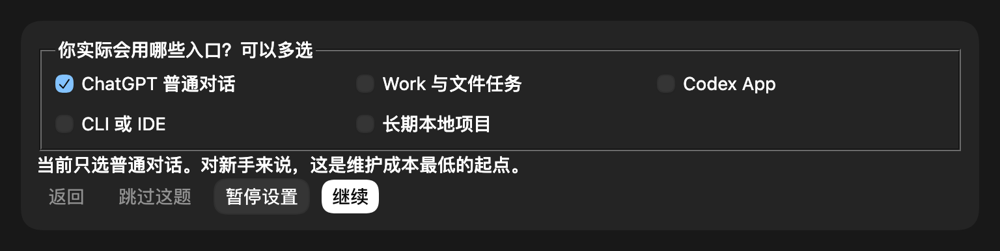
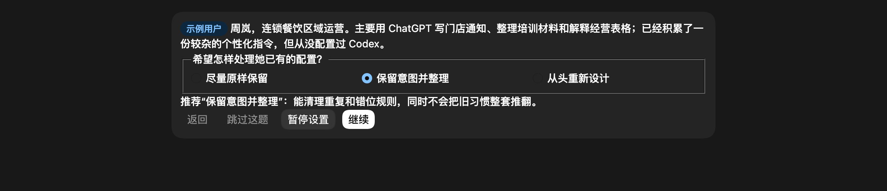

# supɃewhY-P13N

> 一套有交互过程的 ChatGPT / Codex 个性化 Skill：先弄清你怎么工作，再把规则放到正确的位置；换电脑时，把能安全迁移的本地配置一起带走。

`P13N` 是 **Personalization（个性化）** 的缩写：`P` 和 `N` 之间有 13 个字母。

它不是把一份万能 Prompt 塞进所有地方。它会区分新用户、已有配置的用户和不清楚当前状态的用户，通过对话与可选交互界面逐步确认使用入口、重复工作、沟通偏好、执行边界和隐私授权，再决定哪些内容属于 Custom Instructions、Projects、`AGENTS.md`、项目记忆、Skill 或 Hook。

换设备时，它不会复制整个 `CODEX_HOME`。它只迁移经过确认的便携配置，并在导入前预览冲突、写入前自动备份、完成后验证；凭据、登录状态和系统权限留在新设备重新授权。

> **说明：** 这是个人维护的公开项目，不是 OpenAI 官方产品或官方 Skill。

## 关于作者

我是 BewhY，一名设计师，也在持续探索怎样把 AI 变成真正顺手的日常工具。

我做 P13N 的原因很直接：个性化不该变成另一份需要长期维护的说明书。新用户不知道该配什么，老用户怕旧规则被覆盖，换电脑后又经常发现 Skill、`AGENTS.md` 和本地工作流没有一起回来。P13N 惊人的地方不该是规则多，而是它知道什么时候该问、该放在哪里，以及什么绝对不能搬。

我会在小红书记录设计、审美积累、AI 创作实践和工作流搭建过程：

> 📕 [小红书：supBewhY](https://www.xiaohongshu.com/user/profile/5a04313511be1005cafea0f9)

## 为什么需要 P13N

ChatGPT 与 Codex 的个性化分散在不同表面：

- 账户级 Custom Instructions 适合稳定的沟通偏好。
- Projects 适合重复使用的领域上下文、文件和项目指示。
- 全局 `AGENTS.md` 适合 Codex 在不同本地项目中都应遵守的协作规则。
- 项目 `AGENTS.md` 与显式 `MEMORY.md` 协议适合保存仓库事实、命令、决策和踩坑。
- Skill 适合固定输入输出、会重复运行的工作流。
- Hook 或 Rule 适合需要机械阻止的危险操作。

全部写进一份全局个性化，结果往往是普通聊天太重、编程任务又不够具体。P13N 先理解实际工作，再使用最少的配置层解决问题。

## 它会怎样与你互动

P13N 先判断用户属于哪种状态：

1. `fresh-start`：没有有效配置，从最小问诊开始。
2. `revise-existing`：已经有配置，先决定保留、整理还是重建。
3. `unsure`：不清楚配置在哪里，可选纯问卷或经授权的有界清单。

低风险选择可以使用紧凑的交互界面；重复工作、期望交付物和必须保留的习惯仍用普通对话。普通问诊支持返回、跳过和暂停。所有可见交互会跟随当前 Codex 回复语言，英文规则示例不会被当成固定界面文案。隐私扫描、写入、导出、导入和回滚属于高影响操作：宿主支持交互时必须显示独立授权界面，明确写出“等待授权，尚未执行”，并提供“批准并开始、调整范围、取消”；此类步骤不能跳过，默认选中也不算同意。界面不可用时，会降级为醒目的同语言文本确认，而不是把批准要求藏在普通说明里。

### 没有配置过：先问实际使用入口

新用户不会先面对一张几十项的偏好表，也不会被要求扫描电脑。P13N 先确认他实际使用 Chat、Work、Codex、CLI / IDE 还是长期本地项目，然后只问会改变配置结果的信息。



这条路线随后询问最多三个重复工作、期望交付物、主要摩擦和沟通偏好。职业只在确实会改变术语、风险或交付标准时才询问。

### 已经配置过：先保护旧习惯

已有配置的用户不会被要求逐行审核。P13N 先确定一种默认处理姿态：

- **Preserve**：尽量原样保留，只修明确冲突或风险。
- **Consolidate（推荐）**：保留有用意图，允许去重、归位和聚焦改写。
- **Rebuild**：从第一性原理重建，但旧版本会保留到最终预览得到确认。



之后按用途与配置表面分组给出 `keep`、`consolidate`、`replace`、`retire` 或 `user-decision` 建议。分类只产生预览，不等于获得覆盖或删除权限。

## 个性化后会得到什么

根据实际需要，P13N 可以规划、预览或配置：

- ChatGPT Custom Instructions。
- ChatGPT Projects 的项目指示与资料边界。
- Codex 全局 `AGENTS.md`。
- 仓库级 `AGENTS.md` 与显式项目 `MEMORY.md` 协议。
- 可重复工作流对应的用户 Skill。
- 需要机械执行的 Hook 或 Rule。
- 可迁移的 Codex 设置、模板和 MCP 定义。

它不会因为“体系完整”就把每一层都建出来。只用 ChatGPT 的用户不需要先维护 Codex；只做一个临时任务，也不需要创建项目记忆。

## 换设备时，怎样做到低负担迁移

P13N 把迁移拆成一条可检查、可撤销的链路：

1. **盘点**：区分云端同步、本地便携、项目绑定、需要适配、需要重新授权和禁止复制的内容。
2. **选择**：只让用户确认要迁移的项目，不复制整个 Codex 目录。
3. **脱敏导出**：检查疑似密钥，把已知用户目录替换为便携占位符，生成校验和与 ZIP。
4. **目标预览**：在新设备先查看将创建、跳过、保留或发生冲突的项目。
5. **写前备份**：只对明确批准替换的现有本地文件自动建立事务备份。
6. **导入与验证**：应用具体项目决策，检查旧机器路径、敏感内容和保留冲突。
7. **回滚**：需要时只恢复本次事务记录过的路径。

这里的“低负担”不是无条件一键覆盖。它指的是：重复检查和本地备份由工具完成，真正影响结果的冲突集中确认一次；OAuth、账号登录、插件安装和系统权限仍在新设备安全地重新授权。

### 什么不会被迁移

- `auth.json`、Token、密码、Cookie 和会话。
- 聊天历史、日志、缓存、SQLite 运行态和 Socket。
- 浏览器资料、钥匙串、`.env` 和无关私人文件。
- 系统 Skill、插件缓存和来源不明的第三方副本。
- 未经确认的 `config.toml`、Hook、Rule 或机器专用绝对路径。

## 安装

### 个人级安装到 Codex

```bash
git clone https://github.com/supbewhy-sudo/supbewhy-p13n.git
cd supbewhy-p13n

CODEX_SKILLS_DIR="${CODEX_HOME:-$HOME/.codex}/skills"
mkdir -p "$CODEX_SKILLS_DIR"
cp -R ./supbewhy-p13n "$CODEX_SKILLS_DIR/"
```

### 项目级安装

```bash
mkdir -p /path/to/project/.agents/skills
cp -R ./supbewhy-p13n /path/to/project/.agents/skills/
```

也可以下载 [`dist/supbewhy-p13n.zip`](dist/supbewhy-p13n.zip)，解压后复制其中的 `supbewhy-p13n/`。

安装后重启 Codex 或打开新任务，让客户端重新发现 Skill。交互界面是可选增强；宿主不支持时会继续使用普通对话和编号选择。

## 使用方式

### 从零设置

```text
使用 $supbewhy-p13n 帮我配置 ChatGPT 和 Codex 个性化。我没有配置过，请从最小问诊开始，先不要扫描电脑。
```

### 整理已有配置

```text
使用 $supbewhy-p13n 审查我现有的 Custom Instructions 和 AGENTS.md。先保留有用意图并整理，给我预览，不要直接修改。
```

### 不确定现在配了什么

```text
使用 $supbewhy-p13n 帮我判断目前有哪些 Codex 个性化。先说明可检查的路径、范围和成本，得到同意后再读取。
```

### 迁移到新设备

```text
使用 $supbewhy-p13n 盘点这台电脑上可以安全迁移的 Codex 个性化。不要复制凭据、历史和缓存，先给我迁移预览。
```

### 导入迁移包

```text
使用 $supbewhy-p13n 预览这个迁移包。保留新电脑已有配置，先按分组给出推荐方案，不要直接覆盖。
```

## 权限边界

P13N 把建议、检查、预览和写入视为不同权限：

- “你能帮我配置什么”只得到能力说明。
- “检查这些路径”只在明确范围与授权后只读检查。
- “先给我看变化”只生成预览。
- “应用这些已确认的文件”才允许修改具体本地目标。
- 迁移导出、导入和回滚分别需要明确授权，不能互相推断。

选择 Preserve、Consolidate 或 Rebuild 只影响推荐方式，不等于授权写入。

## 仓库结构

```text
.
├── README.md
├── docs/images/
│   ├── fresh-start.png
│   └── revise-existing.png
├── supbewhy-p13n/
│   ├── SKILL.md
│   ├── agents/openai.yaml
│   ├── assets/
│   ├── references/
│   └── scripts/
├── scripts/
│   ├── build_release.py
│   └── validate_skill.py
├── tests/
│   ├── test_contract.py
│   └── test_release.py
└── dist/
    └── supbewhy-p13n.zip
```

Skill 本体只保留核心路由与执行规则；问诊字段、隐私扫描、配置分层、交互、迁移和手动交接细节按需加载。确定性的盘点与迁移逻辑由 Python 脚本执行，避免每次临时重写。

## 验证

```bash
python3 scripts/build_release.py
python3 scripts/validate_skill.py .
python3 -m unittest discover -s tests -v
```

自动检查覆盖：

- Skill 目录、frontmatter 和 UI 元数据。
- `SKILL.md` 引用的参考文件是否存在。
- Python 脚本语法。
- 交互问诊、授权边界、备份和迁移合同。
- README 图片引用和发行 ZIP 完整性。
- 公开包中是否出现本机绝对路径或常见密钥形态。

自动测试证明结构与发布合同一致，但不能代替真实客户端、不同操作系统和不同账号环境中的行为评测。

## 版本

- 当前版本：`0.1.0`
- 产品定位：交互式 ChatGPT / Codex 个性化与安全迁移 Skill
- 公开 Skill 名称：`supbewhy-p13n`
- 展示名称：`supɃewhY-P13N`

## 参与改进

如果你遇到问诊过长、误覆盖、配置放错层、扫描边界不清、迁移冲突或无法回滚，请提交 Issue，并附上：

- 使用的入口和目标。
- 触发请求。
- 实际发生的路由或建议。
- 你预期的行为。
- 是否涉及真实写入，以及能否从备份恢复。

请删除凭据、私人路径和真实配置内容后再提交。
